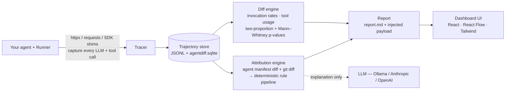

# AgentDiff

**Behavioral regression testing for Python AI agent systems — any LLM provider, any framework, none required.**

[](https://github.com/Svkayy/agentdiff/actions/workflows/ci.yml)
[](LICENSE)
[](pyproject.toml)
[](CHANGELOG.md)

When you change an agent's prompts, model parameters, or routing code, the final
output often still looks fine while the *internal* behavior has silently shifted:
a sub-agent stops firing, a tool gets called twice as often, a different document
gets retrieved. Traditional output evaluation misses this. **AgentDiff catches
these behavioral regressions and tells you exactly which code or prompt change
caused each one.**

<p align="center">
  
</p>

<p align="center"><em>A real run: a one-line change silently disabled a sub-agent. Output eval still says PASS — AgentDiff says FAIL and points at the exact line.</em></p>

---

## Table of contents

- [Why AgentDiff](#why-agentdiff)
- [Quick start](#quick-start)
- [The dashboard](#the-dashboard)
- [How it works](#how-it-works)
- [The CI gate](#the-ci-gate)
- [Hosted platform](#hosted-platform)
- [Capture coverage](#capture-coverage)
- [The Runner](#the-runner)
- [CLI reference](#cli-reference)
- [Development](#development)
- [Documentation](#documentation)
- [Project status](#project-status)

## Why AgentDiff

Two things distinguish AgentDiff from trace viewers and output-eval harnesses:

1. **Universal capture.** The foundation is HTTP-level interception (`httpx` +
   `requests`), so AgentDiff captures every LLM call regardless of provider or
   wrapper — Anthropic, OpenAI, Gemini, Mistral, Bedrock, Cohere, Azure OpenAI,
   LiteLLM, a local Ollama, or a raw `httpx.post` to a provider it's never heard
   of. SDK shims (Anthropic, OpenAI, MCP) add richer metadata when present, but
   capture never depends on them.
2. **Causal attribution.** For each behavioral delta, AgentDiff maps it back to a
   specific changed file — and where possible, the exact unified-diff hunk — using
   a deterministic rule engine over a dynamically-built agent manifest plus the
   git diff. The LLM is only used to write a 1–3 sentence explanation, never to
   decide the attribution.

The verdict is statistics, not vibes: agent-invocation and tool-usage deltas are
tested with two-proportion z-tests and Mann–Whitney U, corrected with
Benjamini–Hochberg at α = 0.05. The same runs always produce the same result.

## Quick start

Install from source (PyPI release pending):

```bash
git clone https://github.com/Svkayy/agentdiff.git
cd agentdiff
pip install -e .
```

### Zero-setup: record and diff

The fastest way to a behavioral diff — no config, no test cases, no git
baseline. Wrap the code you already run, before and after your change:

```python
import agentdiff

with agentdiff.record("before"):
    run_my_agent("some input")   # your agent, however you normally call it

# ... make your prompt / code change ...

with agentdiff.record("after"):
    run_my_agent("some input")
```

```bash
agentdiff diff before after --serve
```

You get the before/after agent graph with any agent that stopped firing lit up
in signal orange. Structure is auto-inferred, so agents show real names without
any setup. Attribution here is observed-only (prompt/model/tool-set changes from
the captured data); for the exact code-diff hunk, use the full `compare` flow
below.

### Full flow: compare against a git ref

For hunk-level attribution, compare your working tree against a committed
baseline:

```bash
agentdiff quickstart                          # infer structure, runner, config, test cases
agentdiff doctor --project .                  # validate the generated setup
agentdiff compare --baseline main --samples 8 # sample both refs, diff, attribute
```

The report lands in `.agentdiff/reports/<timestamp>/` as `report.md`, raw
trajectory JSONL, a queryable `agentdiff.sqlite`, and a self-contained
`dashboard.html`.

### Try the bundled demo

Reproducible end to end with a local [Ollama](https://ollama.com) — no API keys:

```bash
ollama pull llama3.1:8b
pip install -e ".[openai]"
bash examples/research_assistant/run_demo.sh
agentdiff dashboard --report-dir docs/demo/sample-report --serve
```

The sample agent ([`examples/research_assistant/`](examples/research_assistant/))
is an orchestrator routing to `retriever`, `fact_checker`, and `summarizer`
sub-agents. The candidate change disables `fact_checker` with a one-line early
`return` — the answer still reads fine, so output-eval passes while AgentDiff
fails and attributes the regression to `agents/fact_checker.py`.

## The dashboard

`agentdiff dashboard --serve` renders any run in a local, offline, single-file UI
(React + React Flow + Tailwind/shadcn). Five views — every pixel below is **real
data from a real `agentdiff compare` run** (see [`docs/demo/`](docs/demo/)):

**1 · Overview** — the before/after agent graph as the hero, any stopped agent
lit in signal orange, a verdict banner, and the "output eval PASS / AgentDiff
FAIL" contrast that is the product's whole thesis (hero GIF above).

**2 · Behavioral Deltas** — every agent-invocation and tool-usage delta, per test
case, with baseline/candidate rates, the signed delta, p-value, significance, and
verdict:

<p align="center"></p>

**3 · Causal Attribution** — each non-passing delta mapped to the file and exact
diff hunk that caused it, with a model-written explanation and the alternatives
the rule engine considered:

<p align="center"></p>

**4 · Trajectory Timeline** — the captured LLM- and tool-call sequence. Toggle
baseline → candidate and watch the regressed agent's calls disappear:

<p align="center"></p>

**5 · Run Summary** — run quality (trajectories, failure budget), thresholds,
traditional output-eval details (semantic/structural/length/judge), and a
copy-paste reproduction command:

<p align="center"></p>

## How it works



Capture and attribution are deterministic; the LLM is used **only** for the
optional output-eval judge and the per-delta natural-language explanation —
never to decide a verdict or an attribution.

**Stack:** Python 3.10+ engine (Click/Rich CLI, NumPy stats, Pydantic v2,
SQLite/JSONL storage) · TypeScript dashboard (Vite, React 18, React Flow,
Tailwind/shadcn) · optional pluggable LLM (Ollama / Anthropic / OpenAI) for the
judge and explanations only.

Every report contains: the header (refs, sample math, overall verdict) · the
traditional-eval vs AgentDiff side-by-side · behavioral findings with
PASS/WARN/FAIL verdicts · runtime deltas (latency, tokens, error rate, each with
its own significance test) · causal attribution (cause file, rule, hunk,
explanation) · a reproduction command.

## The CI gate

`agentdiff ci run` turns the compare engine into a pipeline gate. On every PR it
samples the agent on both refs, diffs behavior, attributes any regression to the
exact hunk, and delivers the result everywhere your team looks:

- **PR check + comment** — verdict, findings, and cause, upserted into one comment.
- **Slack brief** — PM-readable in three seconds: what broke, the likely cause,
  and buttons for the report, the PR, and the CI run. Color-coded by verdict.
- **Postmortem draft** — `postmortem.md` written on every run, ready to paste
  into your incident tracker.
- **Artifacts** — every verdict is reconstructable from `summary.json`,
  `comparison.json`, `attribution.json`, and `slack_payload.json`.

Two execution tiers:

| Tier | Cost | Determinism | Catches |
|------|------|-------------|---------|
| `hermetic` (default) | $0, no API keys | fully deterministic (cassette replay) | agent-invocation, tool-usage, routing regressions |
| `live` (opt-in) | N samples × 2 refs of real calls | statistical | everything hermetic catches **plus** output-quality drift |

```bash
# Record a cassette once on a known-good ref
agentdiff ci run --tier hermetic --cassette .agentdiff/cassettes/main.jsonl \
  --cassette-mode record --baseline origin/main

# Gate every PR for free
agentdiff ci run --tier hermetic --cassette .agentdiff/cassettes/main.jsonl
```

Or drop the composite GitHub Action into a workflow:

```yaml
- uses: actions/checkout@v4
  with:
    fetch-depth: 0
- uses: Svkayy/agentdiff@main
  with:
    tier: hermetic
    cassette: .agentdiff/cassettes/main.jsonl
    slack-channel: C0123456789
```

Delivery is degrade-not-swallow by design: if Slack or GitHub is down, the
verdict still lands in the PR check and artifacts. Fork PRs run the hermetic
tier with zero secrets — see [docs/integrations.md](docs/integrations.md) for
the security model.

## Hosted platform

AgentDiff also ships a multi-tenant platform — API, background worker, and the
same React dashboard — that teams can self-host with one command:

```bash
cp .env.example .env   # fill in Clerk keys + Fernet encryption key
docker compose up --build -d
```

Five services start (`postgres`, `redis`, `api`, `worker`, `dashboard`). The
browser UI is one Vite SPA: public landing/docs/legal routes at `/`, `/docs`,
`/privacy`, `/terms`, and Clerk-gated dashboard routes at `/projects` and
`/runs/:id`. Sign in, create a project, mint an API key, then point CI and your
live `LiveCollector` at the API. Drift detection runs every 5 minutes and posts
Slack briefs on `warn`/`fail` verdicts.

- **[Hosted quickstart](docs/hosted-quickstart.md)** — Clerk setup, CI wiring,
  live monitoring, Slack config, troubleshooting.
- **[Deploying to production](docs/deploy-production.md)** — the
  `docker-compose.prod.yml` overlay (one-shot migrations, nginx TLS, internal
  networking), Vercel hosting for the UI, backups, scaling, secret rotation.

## Capture coverage

**Providers.** Canonical parsers ship for Anthropic Messages, OpenAI Chat,
OpenAI Responses, Google Gemini (incl. streaming), Mistral, AWS Bedrock
(Anthropic, Titan, Nova, Llama, Mistral, Cohere, AI21 + generic fallback),
Azure OpenAI, and Cohere. **Anything else** is still captured at the raw HTTP
layer — add a parser in `src/agentdiff/capture/http/parsers/` or a pattern to
`.agentdiff/providers.yaml` to upgrade it to canonical fields. Streaming bodies
(SSE, NDJSON, JSON-array) are reconstructed into `stream_chunk` timeline events
when captured via `httpx`, `requests`, or `aiohttp`.

**Frameworks and transports** — optional soft-import adapters, enabled under
`capture:` in `.agentdiff/config.yaml`, that no-op when the dependency is
absent:

| Adapter | Captures |
|---|---|
| LangGraph | graph invokes, `StateGraph.add_node` node spans, edge registrations |
| CrewAI | crew kickoff, agent task execution, task execution |
| AutoGen | speaker turns, message receives, reply generation |
| LlamaIndex | query engines, retrievers, router retrievers |
| aiohttp | provider-aware HTTP LLM request/response capture |
| gRPC | unary/stream RPC call spans as framework events |

**Install extras.** The base install brings only `httpx` + `requests` (plus
comparison/report deps). Everything else is opt-in:

```bash
pip install -e ".[anthropic]"   # or [openai], [mcp], [aiohttp], [grpc], [frameworks], [embeddings], [all]
```

AgentDiff's own LLM use (judge + explainer) needs one of `ANTHROPIC_API_KEY` /
`OPENAI_API_KEY`, selected by `AGENTDIFF_LLM_PROVIDER` (default `anthropic`).
Point `OPENAI_BASE_URL` at a local Ollama (`http://localhost:11434/v1`) with
`AGENTDIFF_LLM_MODEL` to run fully locally — that's how the demo above is
generated. If no provider is reachable, the judge and explanations are skipped;
behavioral findings and rule-based attribution still run.

## The Runner

For sampled comparisons, the only code you write is a **Runner** — a
`Callable[[dict], dict | str | None]` that fires one observable invocation of
your agent and returns its outcome. The only project-specific decisions
AgentDiff can't infer are **settling** (when is one invocation done?) and
**outcome collection** (what's the observable result?). Copy-paste recipes
cover the common shapes:

| Trigger shape | Recipe |
|------------------|--------|
| Request-response | [`request_response.py`](docs/recipes/request_response.py) |
| Event-driven | [`event_driven.py`](docs/recipes/event_driven.py) |
| Scheduled / cron | [`scheduled.py`](docs/recipes/scheduled.py) |
| Multi-turn chat | [`multi_turn.py`](docs/recipes/multi_turn.py) |

Decorate in-process Python tools dispatched from LLM `tool_use` blocks with
`@agentdiff.tool` so they appear in the trajectory. Existing traffic can seed
regression cases without hand-written personas:

```bash
agentdiff traffic discover --from prod-sample.jsonl --output .agentdiff/test_cases.yaml
```

## CLI reference

```
agentdiff init       Scan a project, infer structure, scaffold .agentdiff/.
agentdiff quickstart Infer structure + runner and create a runnable starter setup.
agentdiff compare    Sample baseline + candidate, compare behavior, evaluate output, attribute deltas.
agentdiff diff       Diff two zero-setup record() captures.
agentdiff traffic    Discover test cases from JSONL/JSON/CSV/text traffic samples.
agentdiff ci         Run AgentDiff as a CI gate: artifacts, PR comment, Slack brief, postmortem draft.
agentdiff dashboard  Generate or serve a local HTML dashboard for a run.
agentdiff monitor    Run local compare monitoring or summarize the latest report.
agentdiff doctor     Validate config, runner imports, git refs, hook status, and optional deps.
agentdiff hook       Manage the optional autoload hook: status/install/uninstall.
agentdiff structure  Refresh structure.yaml, preserving user-edited display names.
agentdiff replay     Deterministically re-run the runner against a recorded HTTP cassette.
```

Hardened release settings for `compare`:

```bash
agentdiff compare --baseline main --samples 20 --workers 4 --no-install-deps --max-failure-rate 0.05
```

Thresholds, capture shims, dependency installation, and sample failure budgets
are configured in `.agentdiff/config.yaml` — see
[docs/reference-config.md](docs/reference-config.md).

## Development

```bash
# Engine (Python)
pip install -e ".[dev]"
pytest tests/ -q                 # hermetic — external LLM/HTTP calls are mocked
ruff check src/ tests/
mypy src/agentdiff

# Dashboard (TypeScript)
npm --prefix frontend ci
npm --prefix frontend run build      # tsc --noEmit && vite build
npm --prefix frontend run test       # vitest
npm --prefix frontend run build:cli  # single-file local report bundle
```

CI ([`.github/workflows`](.github/workflows)) runs the engine suite, lint, type
check, and the frontend tests/build on every push. See
[CONTRIBUTING.md](CONTRIBUTING.md) for the workflow and
[SECURITY.md](SECURITY.md) for reporting vulnerabilities.

## Documentation

| Doc | What it covers |
|-----|----------------|
| [Tutorial: Getting Started](docs/tutorial-getting-started.md) | Zero to first report — install, write a Runner, run a comparison, read the output |
| [How-to: Interpret the Report](docs/howto-interpret-report.md) | Read PASS/WARN/FAIL verdicts, attribution confidence, and decide what to do |
| [Reference: config.yaml](docs/reference-config.md) | Every config option with type, default, and effect |
| [Explanation: Why Behavioral Testing](docs/explanation-why-behavioral.md) | Why output evaluation misses agent regressions |
| [Integrations](docs/integrations.md) | Slack, GitHub PR comments, webhooks, and the fork-PR security model |
| [CI Troubleshooting](docs/recipes/ci-troubleshooting.md) | Runbook for every CI-gate failure mode |
| [Runner Recipes](docs/recipes/README.md) | Copy-paste Runner patterns for all four trigger shapes |
| [METHODOLOGY.md](docs/METHODOLOGY.md) | Capture → comparison → attribution pipeline in detail |
| [CODEBASE.md](docs/CODEBASE.md) | Module-by-module implementation reference |
| [Data Handling](docs/data-handling.md) | What's captured, redaction modes, storage, retention, how to disable capture |
| [Hosted Quickstart](docs/hosted-quickstart.md) | Self-host the platform: Clerk, CI wiring, live monitoring, Slack |
| [Deploying to Production](docs/deploy-production.md) | TLS, backups, scaling, and secret rotation |
| [Limitations](docs/recipes/limitations.md) | What v0 deliberately does not support, and workarounds |

## Project status

AgentDiff `0.x` has local quickstart, traffic discovery, framework adapters,
stream timelines, worker-based sampling, monitoring, dashboard artifacts, a CI
gate, and a self-hostable multi-tenant platform. It is not yet a managed SaaS,
a distributed load generator, or a production tap that ingests live traffic
without a Runner boundary — see
[docs/recipes/limitations.md](docs/recipes/limitations.md) for the current line.

AgentDiff follows [Semantic Versioning](https://semver.org/). While the project
is `0.x`, minor bumps may still contain breaking changes; from `1.0.0` the usual
SemVer contract applies. See [CHANGELOG.md](CHANGELOG.md).

## License

[MIT](LICENSE) © 2026 AgentDiff contributors
