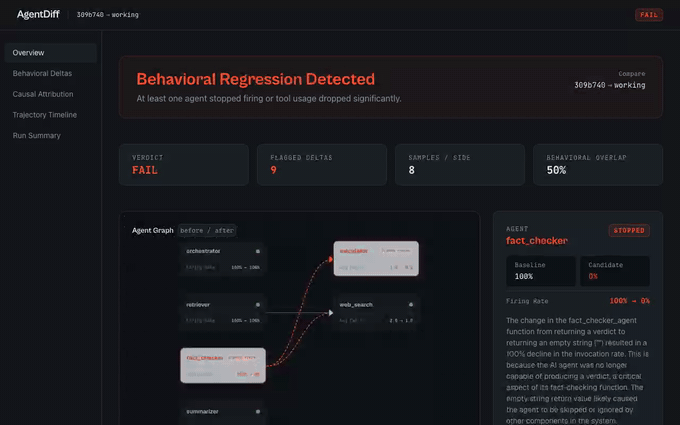
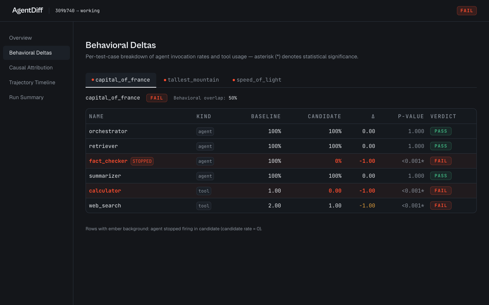
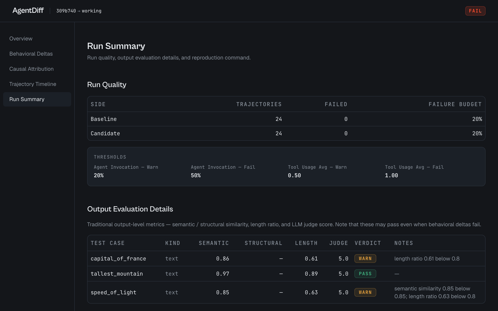
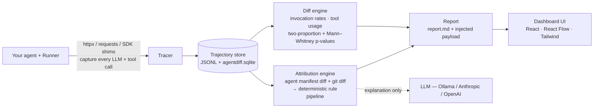
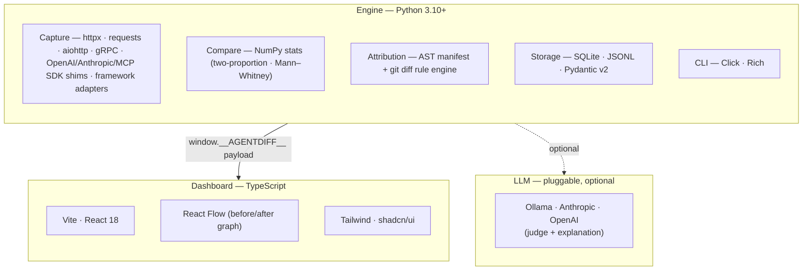

# AgentDiff

**Behavioral regression testing for Python AI agent systems — any LLM provider, any framework, none required.**

When you change an agent's prompts, model parameters, or routing code, the final
output often still looks fine while the *internal* behavior has silently shifted:
a sub-agent stops firing, a tool gets called twice as often, a different document
gets retrieved. Traditional output evaluation misses this. **AgentDiff catches
these behavioral regressions and tells you exactly which code or prompt change
caused each one.**

<p align="center">
  
</p>

<p align="center"><em>A real run: a one-line change silently disabled a sub-agent. Output eval still says PASS — AgentDiff says FAIL and points at the exact line.</em></p>

## Two differentiators

1. **Universal capture.** The foundation is HTTP-level interception (`httpx` +
   `requests`), so AgentDiff captures every LLM call regardless of provider or
   wrapper — Anthropic, OpenAI, Gemini, Mistral, Bedrock, Cohere, Azure OpenAI,
   LiteLLM, a local Ollama, or a raw `httpx.post` to a provider it's never heard
   of. SDK shims (Anthropic, OpenAI, MCP) add richer metadata when present, but
   capture never depends on them.
2. **Causal attribution.** For each behavioral delta, AgentDiff maps it back to a
   specific changed file — and where possible, the exact unified-diff hunk — using
   a deterministic rule engine over a dynamically-built agent manifest plus the
   git diff. The LLM is only used to write a 1–3 sentence explanation, never to
   decide the attribution.

## The dashboard

`agentdiff dashboard --serve` renders any run in a local, offline, single-file UI
(React + React Flow + Tailwind/shadcn). It has **five views**, every one shown
below — and every pixel is **real data from a real `agentdiff compare` run**
(see [`docs/demo/`](docs/demo/)).

**1 · Overview** — the before/after agent graph as the hero, with any stopped
agent lit ember; a verdict banner; and the "output eval PASS / AgentDiff FAIL"
contrast that is the product's whole thesis (shown in the hero GIF at the top).

**2 · Behavioral Deltas** — every agent-invocation and tool-usage delta, per test
case, with baseline/candidate rates, the signed delta, p-value, significance, and
verdict. Stopped agents are lit ember.

<p align="center"></p>

**3 · Causal Attribution** — each non-passing delta mapped to the file and exact
diff hunk that caused it, with a model-written explanation and the alternatives
the rule engine considered:

<p align="center"></p>

**4 · Trajectory Timeline** — the captured LLM- and tool-call sequence. Toggle
baseline → candidate and watch the regressed agent's calls disappear:

<p align="center"></p>

**5 · Run Summary** — run quality (trajectories, failure budget), thresholds, the
traditional output-eval details (semantic/structural/length/judge), and a
copy-paste reproduction command:

<p align="center"></p>

## Try the demo

The dashboards above are reproducible end to end (needs a local
[Ollama](https://ollama.com) with the model pulled — no API keys):

```bash
ollama pull llama3.1:8b
pip install -e ".[openai]"

# Real compare run on the bundled sample agent → docs/demo/sample-report/
bash examples/research_assistant/run_demo.sh

# Open the report in the dashboard
agentdiff dashboard --report-dir docs/demo/sample-report --serve
```

The sample agent ([`examples/research_assistant/`](examples/research_assistant/))
is an orchestrator that routes to `retriever`, `fact_checker`, and `summarizer`
sub-agents. The candidate change disables `fact_checker` with a one-line early
`return` — the answer still reads fine, so traditional output-eval passes while
AgentDiff catches the regression and attributes it to `agents/fact_checker.py`.

## Architecture



Capture and attribution are deterministic; the LLM is used **only** for the
optional output-eval judge and the per-delta natural-language explanation —
never to decide a verdict or an attribution.

## Tech stack



## Install

```bash
pip install agentdiff
```

Or from source, for development:

```bash
pip install -e .
```

## Quick start

```bash
# 1. Infer structure, runner, starter config, and starter test cases.
agentdiff quickstart

# 2. Review .agentdiff/config.yaml and add at least one real input.
agentdiff doctor --project .

# 3. Compare against an inferred git baseline, or run a smoke comparison
#    when no git baseline exists yet.
agentdiff compare --baseline auto --samples 3
```

The report lands in `.agentdiff/reports/<timestamp>/report.md`.
The same directory also contains raw trajectory JSONL files and
`agentdiff.sqlite`, a queryable SQLite artifact for the run, plus a local
`dashboard.html`.

## Zero-setup: capture and diff (no Runner)

The fastest way to a behavioral diff — no Runner, no `test_cases.yaml`, no git
baseline. Wrap the code you already run, before and after your change:

```python
import agentdiff

with agentdiff.record("before"):
    run_my_agent("some input")   # your agent, however you normally call it

# ... make your prompt / code change ...

with agentdiff.record("after"):
    run_my_agent("some input")
```

Then diff the two captures and open the dashboard:

```bash
agentdiff diff before after --serve
```

> **Auto-LLM explanations:** when `ANTHROPIC_API_KEY` is set and `--baseline` is
> provided, LLM explanations are generated automatically for the top findings.

You get the before/after agent graph with any agent that stopped firing lit up.
Structure is auto-inferred, so agents show real names without `agentdiff init`.

Attribution here is observed-only: it can tell you the prompt, model, or tool set
changed (from the captured data), but not the exact code-diff hunk, because the
"before" source is gone by diff time. For the precise hunk, use the full
`agentdiff compare` flow against a git ref, or `agentdiff diff before after
--baseline <ref>` when the "before" code is a committed ref.

## The Runner

The only code you write is a **Runner** — a `Callable[[dict], dict | str | None]`
that fires one observable invocation of your agent and returns its outcome.
AgentDiff supports four trigger shapes out of the box, each with a copy-paste
recipe in [`docs/recipes/`](docs/recipes/README.md):

| Trigger shape    | Recipe |
|------------------|--------|
| Request-response | [`request_response.py`](docs/recipes/request_response.py) |
| Event-driven     | [`event_driven.py`](docs/recipes/event_driven.py) |
| Scheduled / cron | [`scheduled.py`](docs/recipes/scheduled.py) |
| Multi-turn chat  | [`multi_turn.py`](docs/recipes/multi_turn.py) |

The only project-specific decisions AgentDiff can't infer are **settling** (when
is one invocation done?) and **outcome collection** (what's the observable
result?). The recipes show the common patterns.

You may also decorate in-process Python tools dispatched from LLM `tool_use`
blocks with `@agentdiff.tool` so they appear in the trajectory.

## What the report contains

1. **Header** — refs, sample math, overall verdict.
2. **Traditional eval vs AgentDiff** — the headline side-by-side. Traditional
   output evaluation can say PASS while AgentDiff says FAIL. That contrast is the
   point.
3. **Behavioral findings** — per-agent invocation rates, tool-usage counts, and
   tool-set overlap, with PASS/WARN/FAIL verdicts.
4. **Runtime deltas** — latency, token-usage, and error-rate shifts between
   baseline and candidate, each with its own significance test and verdict, so
   a regression that changes cost or speed without changing agent routing
   still surfaces.
5. **Causal attribution** — for each non-passing delta: the primary cause file,
   the rule that fired, the diff hunk, and a short explanation.
6. **Reproduction command.**

## Provider coverage

Canonical parsers ship for: Anthropic Messages, OpenAI Chat, OpenAI Responses,
Google Gemini (incl. streaming), Mistral, AWS Bedrock (Anthropic, Titan, Nova,
Llama, Mistral, Cohere, AI21 + generic fallback), Azure OpenAI, and Cohere.
**Anything else** is still captured via the raw HTTP layer (request/response
bytes tagged with the URL) — add a parser in
`src/agentdiff/capture/http/parsers/` or a pattern to `.agentdiff/providers.yaml`
to upgrade it to canonical fields.

Streaming HTTP bodies in SSE, NDJSON, and JSON-array forms are reconstructed into
`stream_chunk` timeline events when captured via `httpx`, `requests`, or
`aiohttp`.

## Framework and transport adapters

AgentDiff installs optional, soft-import adapters for:

| Adapter | Captures |
|---|---|
| LangGraph | graph invokes, `StateGraph.add_node` node spans, edge registrations |
| CrewAI | crew kickoff, agent task execution, task execution |
| AutoGen | speaker turns, message receives, reply generation |
| LlamaIndex | query engines, retrievers, router retrievers |
| aiohttp | provider-aware HTTP LLM request/response capture |
| gRPC | unary/stream RPC call spans as framework events |

These adapters are enabled in `.agentdiff/config.yaml` under `capture:` and do
not require the dependencies to be installed. If the dependency is absent, the
adapter no-ops.

Existing traffic can seed regression cases without hand-written personas:

```bash
agentdiff traffic discover --from prod-sample.jsonl --output .agentdiff/test_cases.yaml
```

Local monitoring/dashboard commands:

```bash
agentdiff dashboard --serve
agentdiff monitor --once
agentdiff monitor --run-compare --interval 300
```

## Installation extras

Base install brings only `httpx` + `requests` (plus comparison/report deps). SDK
shims are optional and auto-detected:

```bash
pip install -e ".[anthropic]"   # or [openai], [mcp], [aiohttp], [grpc], [frameworks], [all]
```

AgentDiff's own LLM use (output-eval judge + attribution explainer) needs one of
`ANTHROPIC_API_KEY` / `OPENAI_API_KEY`, selected by `AGENTDIFF_LLM_PROVIDER`
(default `anthropic`). Point `OPENAI_BASE_URL` at a local **Ollama**
(`http://localhost:11434/v1`) with `AGENTDIFF_LLM_MODEL` to run the judge and
explanations fully locally — that's how the demo above is generated. If no
provider is reachable, the judge and explanation are skipped; behavioral findings
and rule-based attribution still run.

Semantic output similarity uses sentence-transformers and is optional:

```bash
pip install -e ".[embeddings]"
```

Without that extra, AgentDiff still runs behavioral comparison, structural
output diffs, length checks, and optional LLM judging.

## CLI

```
agentdiff init       Scan a project, infer structure, scaffold .agentdiff/.
agentdiff quickstart Infer structure + runner and create a runnable starter setup.
agentdiff compare    Sample baseline + candidate, compare behavior, evaluate output, attribute deltas.
agentdiff traffic    Discover test cases from JSONL/JSON/CSV/text traffic samples.
agentdiff ci         Run AgentDiff as a CI gate: artifacts, PR comment, Slack brief, postmortem draft.
agentdiff dashboard  Generate or serve a local HTML dashboard for a run.
agentdiff monitor    Run local compare monitoring or summarize the latest report.
agentdiff doctor     Validate config, runner imports, git refs, hook status, and optional deps.
agentdiff hook       Manage the optional autoload hook: status/install/uninstall.
agentdiff structure  Refresh structure.yaml, merging in added/removed functions
                     while preserving user-edited display names.
agentdiff replay     Deterministically re-run the runner against a recorded HTTP cassette.
```

`agentdiff compare` also supports hardened release settings:

```bash
agentdiff compare --baseline main --samples 20 --workers 4 --no-install-deps --max-failure-rate 0.05
```

Thresholds, capture shims, dependency installation, and sample failure budgets
can be configured in `.agentdiff/config.yaml`.

## The CI gate and incident brief

`agentdiff ci run` turns the compare engine into a pipeline gate. On every PR it
samples the agent on both refs, diffs behavior, attributes any regression to the
exact hunk, and delivers the result everywhere your team looks:

- **PR check + comment** — verdict, findings, and cause, upserted into one comment.
- **Slack brief** — PM-readable in three seconds: what broke, the likely cause,
  and buttons for the report, the PR, and the CI run. Color-coded by verdict
  (pass green / warn amber / fail ember).
- **Postmortem draft** — `postmortem.md` written on every run, ready to paste
  into your incident tracker.
- **Artifacts** — every verdict is reconstructable from `summary.json`,
  `comparison.json`, `attribution.json`, and `slack_payload.json`.

Two execution tiers:

| Tier | Cost | Determinism | Catches |
|------|------|-------------|---------|
| `hermetic` (default) | $0, no API keys | fully deterministic (cassette replay) | agent-invocation, tool-usage, routing regressions |
| `live` (opt-in) | N samples × 2 refs of real calls | statistical (two-proportion + Mann-Whitney) | everything hermetic catches **plus** output-quality drift |

```bash
# Record a cassette once on a known-good ref
agentdiff ci run --tier hermetic --cassette .agentdiff/cassettes/main.jsonl \
  --cassette-mode record --baseline origin/main

# Gate every PR for free
agentdiff ci run --tier hermetic --cassette .agentdiff/cassettes/main.jsonl
```

Or drop the composite GitHub Action into a workflow:

```yaml
- uses: actions/checkout@v4
  with:
    fetch-depth: 0
- uses: ./  # or your-org/agentdiff@v1
  with:
    tier: hermetic
    cassette: .agentdiff/cassettes/main.jsonl
    slack-channel: C0123456789
```

Delivery is degrade-not-swallow by design: if Slack or GitHub is down, the
verdict still lands in the PR check and artifacts. Fork PRs run the hermetic
tier with zero secrets — see
[docs/integrations.md](docs/integrations.md) for the security model.

## Testing

```bash
# Engine (Python)
pip install -e ".[dev]"
pytest tests/ -q                 # behavioral, capture, attribution, storage, and UI-glue tests
ruff check src/ tests/
mypy src/agentdiff

# Dashboard (TypeScript)
npm --prefix frontend ci
npm --prefix frontend run build  # tsc --noEmit && vite build
npm --prefix frontend run test   # vitest
npm --prefix frontend run build:cli  # single-file local report bundle
```

External LLM/HTTP calls are mocked, so the suite is hermetic and runs offline. CI
([`.github/workflows`](.github/workflows)) runs the engine suite, lint, type
check, and the unified frontend tests/build on every push.

## Hosted platform

AgentDiff ships a multi-tenant API + background worker + React dashboard that
teams can self-host with a single command:

```bash
cp .env.example .env   # fill in Clerk keys + Fernet encryption key
docker compose up --build -d
```

Five services start (`postgres`, `redis`, `api`, `worker`, `dashboard`). The
browser UI is one Vite SPA: public landing/docs/legal routes at `/`, `/docs`,
`/privacy`, and `/terms`, with Clerk-gated dashboard routes at `/projects` and
`/runs/:id`. Sign in at `http://localhost:5173/projects`, create a project, mint
an API key, then point CI and your live `LiveCollector` at the API. Drift
detection runs every 5 minutes and posts Slack briefs on `warn`/`fail` verdicts.

See **[docs/hosted-quickstart.md](docs/hosted-quickstart.md)** for the full
walkthrough: Clerk setup, CI wiring, live monitoring, Slack config, and a
troubleshooting table.

For a single public UI link, deploy `frontend/` to Vercel and set
`VITE_CLERK_PUBLISHABLE_KEY` plus `VITE_AGENTDIFF_API_URL`. Vercel hosts only the
browser UI; the API, worker, Postgres, and Redis stay on your Docker/self-hosted
stack. See **[docs/deploy-production.md](docs/deploy-production.md)**.

## What is still not hosted/distributed

AgentDiff has local quickstart, traffic discovery, framework adapters, stream
timelines, worker-based sampling, monitoring, and dashboard artifacts. It is not
yet a hosted SaaS dashboard, distributed load generator, or production tap that
continuously ingests live traffic without a Runner boundary. See
[`docs/recipes/limitations.md`](docs/recipes/limitations.md) for the current
line.

## Documentation

| Doc | What it covers |
|-----|----------------|
| [Tutorial: Getting Started](docs/tutorial-getting-started.md) | Zero to first report — install, write a Runner, run a comparison, read the output |
| [How-to: Interpret the Report](docs/howto-interpret-report.md) | Read PASS/WARN/FAIL verdicts, attribution confidence, and decide what to do |
| [Reference: config.yaml](docs/reference-config.md) | Every config option with type, default, and effect |
| [Explanation: Why Behavioral Testing](docs/explanation-why-behavioral.md) | Why output evaluation misses agent regressions and how AgentDiff catches them |
| [Integrations](docs/integrations.md) | Slack, GitHub PR comments, generic webhook, and the fork-PR security model |
| [CI Troubleshooting](docs/recipes/ci-troubleshooting.md) | Runbook for every CI-gate failure mode: cassette misses, sampling failures, delivery errors |
| [Runner Recipes](docs/recipes/README.md) | Copy-paste Runner patterns for request-response, event-driven, scheduled, and multi-turn agents |
| [METHODOLOGY.md](docs/METHODOLOGY.md) | Capture → comparison → attribution pipeline in detail |
| [CODEBASE.md](docs/CODEBASE.md) | Module-by-module, function-by-function implementation reference |
| [Data Handling](docs/data-handling.md) | What's captured by default, redaction modes, storage locations, hosted retention, how to disable capture |
| [Deploying to Production](docs/deploy-production.md) | TLS, backups, scaling, and secret rotation for the self-hosted platform |
| [Limitations](docs/recipes/limitations.md) | What v0 deliberately does not support, and workarounds |

## Versioning

AgentDiff follows [Semantic Versioning](https://semver.org/). While the
project is `0.x`, **minor version bumps may still contain breaking changes**
— the API and CLI surface are still settling. Once `1.0.0` ships, the usual
SemVer contract applies: breaking changes only on a major bump. See
[CHANGELOG.md](CHANGELOG.md) for what changed in each release.

## License

See [LICENSE](LICENSE).
